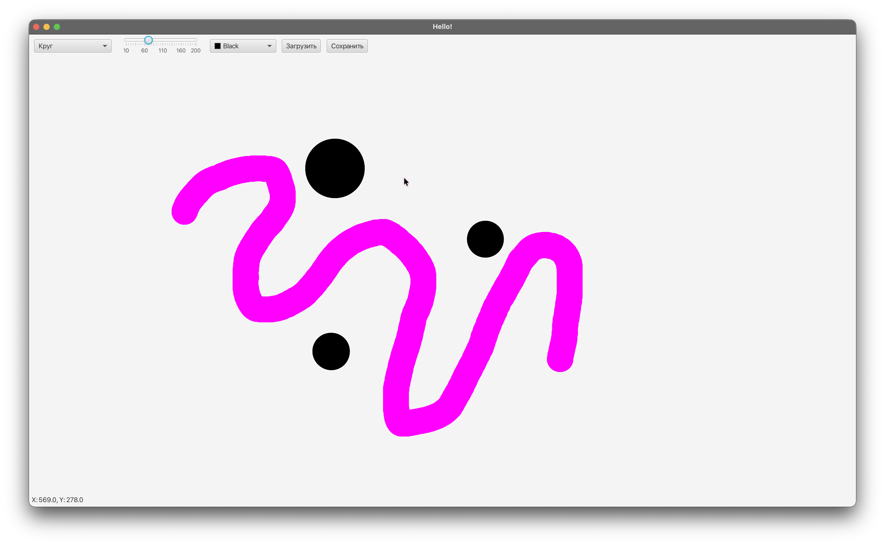

# Happy-piece
----------------

## Описание  
Happy-piece — это JavaFX-приложение для рисования и стирания фигур на Canvas с расширенными возможностями управления. Пользователь может выбирать форму (Квадрат, Круг, Треугольник), цвет и размер фигуры, а также использовать инструмент ластика для удаления. Приложение поддерживает сохранение текущего рисунка в файл и управление историей изменений с помощью паттерна Memento.

Проект решает задачу удобного создания простых графических рисунков, демонстрирует работу с Canvas в JavaFX и реализует механизм отмены/возврата действий.

---

## Технологический стек  
- Java 21  
- JavaFX 21  
- Maven (для сборки)  
- Приложение standalone desktop

---

## Статус  
Alpha

---

## Ссылка на репозиторий и демо  
[GitHub репозиторий](https://github.com/godmozzarella/Happy-piece)

---

## Основные возможности  
- Рисование фигур: Квадрат, Круг, Треугольник  
- Выбор цвета и размера фигуры  
- Инструмент ластика для удаления фигур  
- Сохранение текущего рисунка в файл (например, в формате PNG)  
- Управление историей изменений с помощью паттерна Memento (отмена/повтор действий)  
- Отображение координат курсора  
- Динамическое рисование с перерисовкой Canvas без потери уже нарисованных фигур

---

## Архитектура  
- **Пакет `model`**:  
  - Абстрактный класс `DrawShape` и конкретные фигуры (`Square`, `Circle`, `Triangle`) с реализацией метода `draw`  
  - Инструменты рисования (`BrushTool`) и стирания (`EraserTool`)  
  - Реализация паттерна Memento для сохранения и восстановления состояния рисунка  
- **Контроллер `HelloController`**:  
  - Управляет логикой приложения и взаимодействием с Canvas  
  - Обработка событий мыши для рисования и стирания  
  - Реализация сохранения в файл и управления историей изменений  
- **`HelloApplication`**:  
  - Точка входа в приложение  
  - Загрузка FXML и отображение окна JavaFX  
- **FXML**:  
  - Определяет визуальный интерфейс: Canvas, ComboBox, ColorPicker, Slider, Label, кнопки управления сохранением и историей

---

## Установка и запуск

1. Клонировать репозиторий:  
```bash
git clone git@github.com:godmozzarella/Happy-piece.git
```

2. Перейти в папку проекта:  
```bash
cd Happy-piece
```

3. Собрать проект с помощью Maven:  
```bash
mvn clean install
```

4. Запустить приложение:  
```bash
mvn javafx:run
```

---

## Использование

1. Выберите форму фигуры из ComboBox (Квадрат, Круг, Треугольник).  
2. Выберите цвет через ColorPicker.  
3. Настройте размер фигуры через Slider.  
4. Левой кнопкой мыши рисуйте фигуры на Canvas.  
5. Правой кнопкой мыши удаляйте фигуры с Canvas.  
6. Используйте кнопки для сохранения рисунка в файл.  
7. Управляйте историей изменений с помощью кнопок "Отменить" и "Повторить".  
8. Координаты курсора отображаются в Label.

---

## Особенности реализации

- **Сохранение в файл**:  
  Позволяет экспортировать текущее содержимое Canvas в изображение PNG для дальнейшего использования или обмена.

- **Паттерн Memento**:  
  Реализован для сохранения и восстановления состояний списка фигур, что позволяет реализовать функционал отмены и повтора действий пользователя.

- **Оптимизированная перерисовка Canvas**:  
  При каждом изменении Canvas перерисовываются все фигуры из текущего состояния, что исключает потерю ранее нарисованных элементов.

---

## Зависимости

- Java 21  
- JavaFX 21  
- Maven (для сборки и управления зависимостями)  

---

## Ограничения и известные проблемы

- Пересечение треугольников с курсором для стирания реализовано приближённо.  
- Одновременная работа кисти и ластика может вызывать конфликты при одновременном изменении обработчиков мыши.  
- Автоматизированных тестов пока нет — проверка работы происходит визуально через GUI.

---

## Контакты и поддержка

Для вопросов и предложений используйте раздел Issues на GitHub.

---

## Скриншоты


